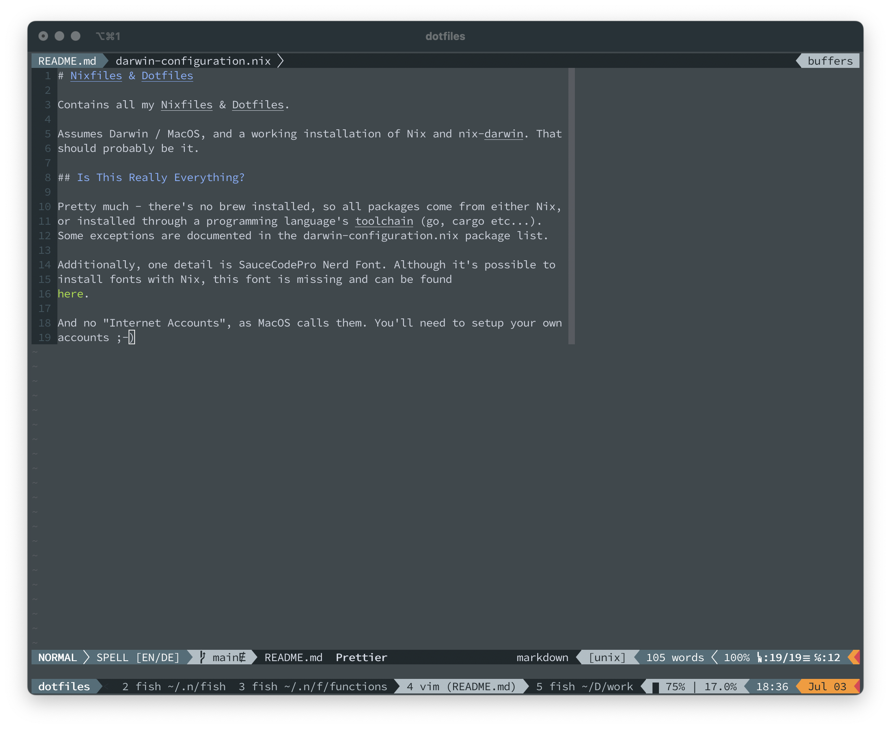
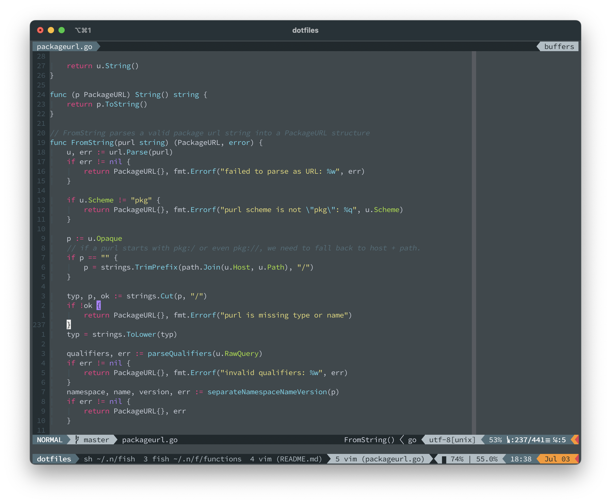
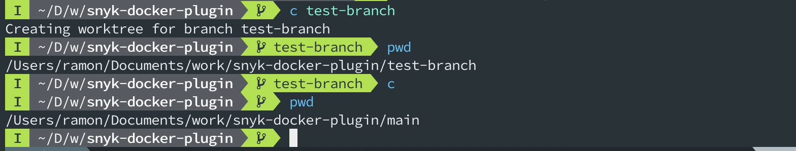

# Nixfiles & Dotfiles

Contains all my Nixfiles & Dotfiles.

Assumes Darwin / MacOS, and a working installation of Nix and nix-darwin. That
should probably be it.

## Is This Really Everything?

Pretty much - there's no `brew` installed, so all packages come from either Nix,
or installed through a programming language's toolchain (`go`, `cargo` etc...).
Some exceptions are documented in the `darwin-configuration.nix` package list.

Additionally, one detail is `SauceCodePro Nerd Font`. Although it's possible to
install fonts with Nix, this font is missing and can be found
[here](https://github.com/Bo-Fone/Liga-Sauce-Code-Pro-Nerd-Font).

And no "Internet Accounts", as MacOS calls them. You'll need to setup your own
accounts ;-)

When setting up your new machine, you'll need to symlink the `nix-channels` file
into your home directory:

```bash
ln -s $(realpath ./nix-channels) ~/.nix-channels
```

That should hopefully be it, but I'll update this once I need to setup a new
laptop...

## How does it look like?




(pictures where taken before the switch to Alacritty).

## What makes it different?

### Completely CLI-based

...except a few, probably weird to many, exceptions.
These Dotfiles setup vim, tmux and alacritty to be your primary driver. No VS
Code, no terminal windows and tabs, no visual Git interface, no whatever else
there might be.

However, the exceptions are:

- Safari: I'm happy with Safari, at least after two plugins: AdBlock and
  [Vimari](https://github.com/televator-apps/vimari). My primary use for it
  is the "link mode", which adds a keybinding to all links on a page.
- Mail: I'm just using the default mail apps. I either don't get as many mails
  as others, or just don't need to answer them as much :)
- Calendar: Also here, default MacOS calendar app. Works for me.
- Slack: ...I know there are CLI-based interfaces for it, but the app has nice
  keybindings as well so it's good enough.

### Heavy use of Git Worktrees

I'm making heavy use of a git feature called "Worktrees". These allow you to
have multiple branches "open" at once, by using different directories. You can
do things like squash changes in one branch - one directory, and `cd` into the
other branch-directory and `squash pop` again.

I find it very useful when writing code as well, where it's super easy to
have a quick glance at the file's state in a different commit / branch / tag.

My helpers are completely built on that, I _never_ checkout a branch in the same
directory anymore.

- `w`: stands for "work", and has three arguments, which triggers three layers:

  - the repository-name as on Github - without the owner. The command will
    switch into the directory of that git repository. And if it shouldn't
    exist, it dynamically checks out the repository into the required
    directory and setting it up with the right worktree setup. The command
    autocompletion lists all existing (remotely, if the repository is not cloned
    yet!) / checked-out repositories.
    All other arguments are optional, which means that if omitted, it will
    simply switch into the `main` or `master` branch. And yes, it will
    automatically detect which one it needs to be. That logic is also available
    under the `default_branch` function!
  - the branch or tag name. Remote-branches are automatically tracked / checked
    out if one exists with the same name. A new git worktree will be created,
    and the command will then `cd` into the created worktree directory.
    The autocompletion suggests local, already checked out branches by default,
    but when the first character of that branch is a `t`, it will suggest all
    tags, and if the first character is an `o`, it will list all origin
    branches. Don't worry, the already checked out branches will be shown first!
    If there's no third argument, it will simply check out the current commit
    if it's a new branch, or just at the existing branch's.
    Will then change into the directory of that branch.
  - the commit to check out. The third argument is a commit hash (or, I guess, a
    branch name would also work, but that's already covered by the 2nd layer),
    and yes, it has autocompletion. This means if you press "tab", a function
    will be called that allows you to visually and with fuzzy-search enabled,
    select a specific commit to check out. This commit-selection is also
    available under the name `git-pick-commit` or as a git alias `git
pick-commit`.

Additionally, as these layers are...layers, the second layer is simply a
second command, `c` for checkout. I haven't yet needed the `git-pick-commit`
function often enough to create a short name for it though.

Last but not least, about that, the shell prompt is also optimised for this.

The general "structure" of my worktrees is the `.git` folder in the "root", and
then a directory per branch in that root. The prompt will not show a branch name
if it's on `main` or `master`. Additionally, the directory name (which is
similar to the branch name) is omitted, so you don't even notice that you're in
a subdirectory:



### Modern

These Dotfiles make heavy use of "modern" replacements for traditional Unix /
Linux tools like "cat", "grep", "sed", "ls" and "find": "bat", "ripgrep", "sd",
"lsd" and "fd".

The invocation `cat` is even directly aliased to `bat`, but can be made
copy-paste friendly by using "copycat": `ccat`. This will omit the line numbers
and styling at the left, which is usually annoying otherwise.

Additionally, `ls` has been mapped to `lsd` as well.

### TODO's

This still configures `vim`, not `neovim`: I so far haven't had the patience to
translate my config.

Additionally,there's a shared clipboard for tmux and vim. And tmux and the
system clipboard. But not for vim and system clipboard, yet :(. This would be a
nice fix.
